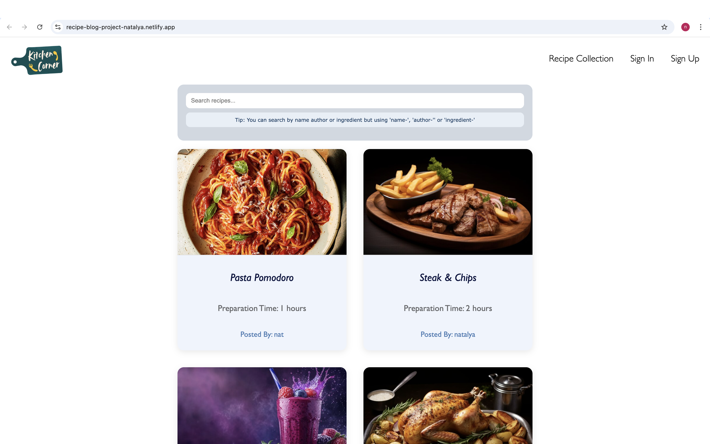
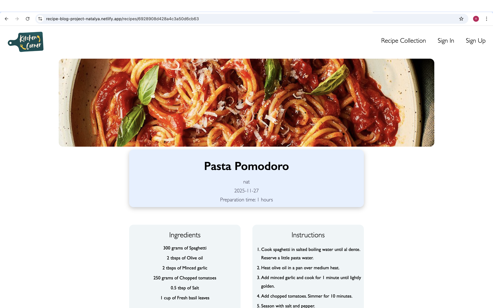

<h1> align='center'>Recipe Blog App 👩‍🍳</h1>

## Description
A full MERN stack CRUD app built after completing Module 3 of the Software Engineering Bootcamp.
Recipe blog application where users can create, share and manage recipes, with secure authentication and image uploads.

## How it Looks



## Deployment Link
<a href="https://recipe-blog-project-natalya.netlify.app/">Live Deployed App<a>

## Getting Started / Code Installation

1 Clone the Repository

```
git clone https://github.com/natalya-nassimi/recipe-blog-project.git
```

2 Navigate into the project folder and open

```
cd recipe-blog-project
```

3 Install dependencies

```
npm install
```

4 Run the app

```
npm start
```

5 Clone the api repository

```
git clone https://github.com/natalya-nassimi/recipe-blog-project-api.git
```

6 Navigate into the project folder

```
cd recipe-blog-project-api
```

7 Install dependencies

```
npm install
```

This app uses Cloudinary's image upload service. This requires 3 additonal environment variables to be added to the .env file as below.
Create an account at cloudinary.com if you don't already have one. You will find your 'Cloud name' on the Home Dashboard page. Click 'Go to API keys' and you will find your API Key and API Secret. Ensure you use the variable names listed below.

8 Create a .env file to include:

```  
    MONGODB_URI=mongodb+srv:// ...
    SESSION_SECRET=
    CLOUDINARY_CLOUD_NAME=
    CLOUDINARY_API_KEY=
    CLOUDINARY_API_SECRET=
```

9 Run the server (Ensure you have Node.js installed)

```
npm run dev
```

10 Visit the URL http://localhost:3000


## Time Frame and Team
This was a 7 day pair project.


## Technologies Used
- Back end: Node.js, Express, MongoDB, Mongoose
- Front end: React, JavaScript, HTML, CSS
- Authentication: JWT
- Image Uploads: Cloudinary

## Brief
Create a MERN stack CRUD app to include:
- RESTful API architecture
- JWT-based authentication
- Full CRUD functionality
- React front-end consuming the API
- Deployed front-end and back-end applications

## Planning
First step was to define user stories and create wireframes, an ERD and routing tables. and core functionality to establish a clear MVP. We then planned the application structure, data models and API endpoints before development. Tasks were divided between us and across the week to ensure steady progress.

### Tools:
- **Trello** for project management and task tracking
- **Miro** for wireframes
- **DBDiagram** for ERD

## Build / Code Process
Steps:
- Built a RESTful API using Express and MongoDB to manage users, recipes and comments.
- Implement JWT-based authentication and middleware to protect routes and enforce ownership.
- Integrated Cloudinary to support image uploads via multipart form data.
- Built a React front end to consume the API and manage authenticated user state.
- Added search functionality to allow users to find recipes, by name, ingredient or author.
- Style main gallery page, forms and show pages using CSS for a clean and usable app.
- Collaborated using Github workflows including branching, pull requests and code reviews.
- Deployed the front-end and back-end separately and connected them in production.

### Code Snippet 1
This function updates a dynamic ingredients form by immutably modifying React state based on user input. It identified the relevant ingredient and field from the input name and updates only that value, keeping complex form data consistent and in sync with user interactions.

```
router.post('', isSignedIn, upload.single('imageURL'), async (req, res) => {
    const handleIngredientChange = (event) => {
        const newFormData = { ...formData };
        const [element, field] = event.target.name.split('-');
        const positionIdx = newFormData.ingredients.findIndex(ingredient => ingredient["name"] == element);
        newFormData.ingredients[positionIdx][field] = event.target.value;
        setFormData(newFormData);
    }
```
### Code Snippet 1
This function sends an authenticated PUT request to update a recipe, including a JWT in the request headers to ensure only authorised users can modify protected data. Centralising this logic into a reusable API helper keeps authenticated requests consistent and the codebbase easier to maintain.

```
const api = axios.create({
    baseURL: `${import.meta.env.VITE_API_URL}/recipes`
});

export const recipeEdit = (recipeId, formData)=>{
    return api.put(`/${recipeId}`, formData, {
        headers: {
            Authorization: `Bearer ${getToken()}`
        }
    });
}
```

## Challenges
- Implementing secure JWT authentication while maintaining smooth user experience and consistent error handling.
- Handling multipart form data.
- Coordinating development within a short time frame.

## Wins
- Clean separation of concerns between client and server.
- Strong error handling that improved reliability and debugging.
- Successful fully functional full-stack application.
- Successful implementation of full CRUD operations across the app.

## Key Takeaways
- The project gave me confidence in designing full-stack applications with clear separation between font-end and back-end and helped me understand how data, authentication and state flow accross an application.

- I developed my approach to error handling and learnt how thoughtful validation and clear feedback improve both user experience and the debugging process.

- Working with image uploads and third-party services like Cloudinary deepened my understanding of integrating external APIs securely and reliably into an application.

- Collaborating in a pair reinforced the importance of clear communication, shared ownership and clean Git workflows when building a shared codebase.

## Bugs
- No known bugs at the moment.

## Future Improvments
- Enhance UI and accessibility.
- Add advanced filtering and sorting options.
- Improve mobile responsiveness.